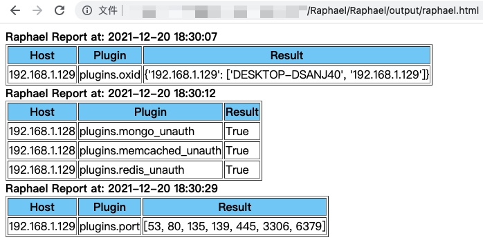

# Raphael

Raphael是一款基于Python3开发的插件式漏洞扫描工具。

Raphael is a vulnerability scanning tool based on Python3.


## Usage

`raphael.py -h`

```text
2021-12-30 18:54:32,198 | INFO  | Raphael Start ~
usage: raphael.py [-h] [-u HOST] [-k PLUGIN] [-l] [-p PORT] [-t THREAD] [-e] [-o OUTPUT] [-f FORMAT]

optional arguments:
  -h, --help                  show this help message and exit
  -u HOST, --host HOST        target host or file
  -k PLUGIN, --plugin PLUGIN  filter plugins by keyword
  -l, --list                  list all exist plugins
  -p PORT, --port PORT        target port
  -t THREAD, --thread THREAD  number of thread, default 5
  -e, --error                 show error message of plugins
  -o OUTPUT, --output OUTPUT  report dir
  -f FORMAT, --format FORMAT  report format, html/json/csv
```

### Example

**List all exist plugins.**

`raphael.py -l`

```text
2021-12-30 18:54:01,128 | INFO  | Raphael Start ~
2021-12-30 18:54:01,130 | INFO  | plugin path: /Raphael/plugins
All Plugins:
  plugins.port
  plugins.log4j_cve_2021_44228
  plugins.grafana_cve_2021_43798
  plugins.mongo_unauth
  plugins.redis_unauth
  plugins.http_banner
  plugins.oxid
  plugins.memcached_unauth
  plugins.apisix_cve_2021_45232
  plugins.zookeeper_unauth
  plugins.thinkphp
```

**Detect unauthorized access vulnerability.**

`raphael.py -u 192.168.1.1/24 -k unauth -t 50`

```text
2021-12-30 18:58:27,072 | INFO  | Raphael Start ~
2021-12-30 18:58:27,074 | INFO  | convert ip segment into ip address
2021-12-30 18:58:27,080 | INFO  | found 4 plugin:
  plugins.mongo_unauth
  plugins.redis_unauth
  plugins.memcached_unauth
  plugins.zookeeper_unauth
2021-12-30 18:58:27,084 | INFO  | raphael got total 1024 tasks
2021-12-30 18:58:27,084 | INFO  | run task in 50 threads
2021-12-30 18:58:32,109 | INFO  | [+] 192.168.1.128 -> plugins.mongo_unauth -> True
2021-12-30 18:58:32,112 | INFO  | [+] 192.168.1.128 -> plugins.memcached_unauth -> True
2021-12-30 18:58:32,147 | INFO  | [+] 192.168.1.134 -> plugins.redis_unauth -> True
2021-12-30 18:58:37,691 | INFO  | total 3 result
2021-12-30 18:58:37,691 | INFO  | report path: output/raphael.html
2021-12-30 18:58:37,692 | INFO  | Finished at: 2021-12-30 18:58:37
2021-12-30 18:58:37,693 | INFO  | Total: 10.621082067489624 s
```

**Port Scan.**

`raphael.py -u 192.168.1.128 -k port`

```text
2021-12-30 18:59:27,309 | INFO  | Raphael Start ~
2021-12-30 18:59:27,311 | INFO  | convert ip segment into ip address
2021-12-30 18:59:27,313 | INFO  | found 1 plugin:
  plugins.port
2021-12-30 18:59:27,314 | INFO  | raphael got total 1 tasks
2021-12-30 18:59:27,314 | INFO  | run task in 5 threads
2021-12-30 18:59:35,892 | INFO  | [+] 192.168.1.128 -> plugins.port -> [22, 53, 2181, 11211, 27017]
2021-12-30 18:59:36,003 | INFO  | total 1 result
2021-12-30 18:59:36,003 | INFO  | report path: output/raphael.html
2021-12-30 18:59:36,007 | INFO  | Finished at: 2021-12-30 18:59:36
2021-12-30 18:59:36,007 | INFO  | Total: 8.698265790939331 s
```

### Report

HTML Report:



## Plugin development

Write your own plugin with python, and then put it into the `plugins` directory.

plugin template:

```python
def run(host, **kwargs):
    result = "vulnerable"
    # do something
    return result
```

e.g.

[redis_unauth.py](./plugins/redis_unauth.py)
